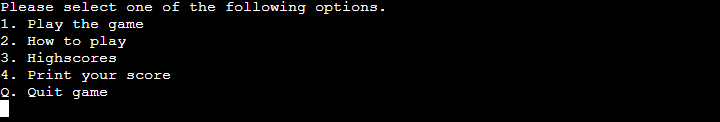

# Tic Tac Toe - Game

**[Live site](https://tic-tac-toe-cipp3.herokuapp.com/)**

---

## Index

- <a href="#context">Context</a>
- <a href="#ux">UX</a>
  - <a href="#ux-stories">User stories</a>
  - <a href="#ux-wireframes">Wireframes</a>
  - <a href="#ux-theme">Theme</a>
- <a href="#features">Features</a>
  - <a href="#features-all">Site wide</a>
  - <a href="#features-future">Still to implement</a>
- <a href="#technologies">Technologies Used</a>
- <a href="#testing">Testing</a>
  - <a href="#testing-auto">Automated</a>
  - <a href="#testing-user-stories">User stories</a>
  - <a href="#testing-manual">Manual</a>
  - <a href="#testing-responsive">Responsiveness</a>
  - <a href="#testing-unresolved">Unresolved issues</a>
  - <a href="#testing-bugs">Known bugs</a>
- <a href="#deployment">Deployment</a>
- <a href="#credits">Credits</a>

---

## Context

Tic-tac-toe, noughts and crosses, or Xs and Os is a paper-and-pencil game for two players who take turns marking the spaces in a three-by-three grid with X or O.
This has been developed for an online use either against a computer or versus another player as you would in the classic game.

<a style="text-align:right" href="#top">Go to index :arrow_double_up:</a>

## UX

### User stories

For ease of reference, the means by which a user's expectations have been met are summarised in the tables below:

| As a **User** I want | How this is achieved                                                                                                                                                           
:-|:-
To be able to play the game against friend or computer. | The game has been designed to let the player have option of both playstyles. When no one is around, get to play against computer or against a friend.
To be able to see my score. | The score is being exported each round to google spreadsheet where user can see everyone's scores. User can see their wins, loses, draws and total games played.
A clean and easy navigation throughout the game menu. | The game has been designed on users main input being numbers which guide them through all available options.

<a style="text-align:right" href="#top">Go to index :arrow_double_up:</a>

## Features

**1. User Name**

- Once the program has executed the user is being asked for their name so the data can be exported to spreadsheet with their own ID so score can be tracked.

**2. Welcome Screen**

- Once the user has input their name, the welcome message gets printed with available options.
- The choice of either finding out how to play the game or starting the game is presented.

**3. How to play**

- Prints to user a short guide of how to play the game.

**4. Game Options**

- User gets the option to play either versus their friend or a computer.

**5. Symbol choice**

- Once the game option has been selected, main player gets to choose their own symbol, either 'X' or an 'O'.

**6. GAME Vs Computer**

- User gets to go first and place their symbol on the grid.
- User has a reference grid beside to not forget which grid has which number assigned.
- Once the move has been completed, another grid is printed out with randomly generated number for computer.

**7. GAME Vs Player**

- Player ONE gets to go first and place their symbol on the grid.
- Both players have a reference grid beside to not forget which grid has which number assigned.
- Once the move has been completed, another grid is printed to player TWO where they get asked for their own move.
- Once their turn is over, player ONE gets asked for another move.

**8. Game over**

- Once one of 8 possible win choices is matched, the user gets a message printed with the result either win, lose or a draw.
- They get the option to exit the program or return to main menu where another game can be started.
- There is unique messages printed depending on either game over scenarios depending if the game was played against computer or another player.

**9. Game quit**

- If the user decided to quit, a message is being printed with their name.

